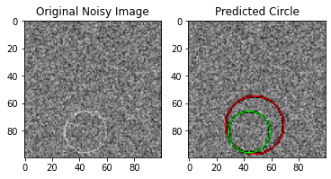
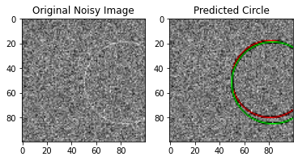

# Noisy Circles
An implementation of a convolutional neural network that identifies the center (x, y) coordinates and radius of a circle given a noisy 100x100 numpy array representing a gray-scale image of the circle.

The convolutional neural network is trained for 16384 epochs on batch-sizes of 128 newly generated training samples using the Adam optimizer. The average intersection-over-union error (1 - average IOU) is used as a loss function. Upon completion of the training-phase, the model achieves an accuracy of > 0.92 IOU

## Architecture

The convolutional neural network contains 7506563 parameters, and its architecture is described and illustrated below:
```
----------------------------------------------------------------
        Layer (type)               Output Shape         Param #
================================================================
            Conv2d-1          [-1, 512, 53, 53]       1,180,160
       BatchNorm2d-2          [-1, 512, 53, 53]           1,024
            Conv2d-3          [-1, 128, 16, 16]       4,194,432
         MaxPool2d-3            [-1, 128, 8, 8]               0
       BatchNorm2d-4            [-1, 128, 8, 8]             256
            Linear-5                  [-1, 256]       2,097,408
            Linear-6                  [-1, 128]          32,896
            Linear-7                    [-1, 3]             387
================================================================
Total params: 7,506,563
Trainable params: 7,506,563
Non-trainable params: 0
----------------------------------------------------------------
Input size (MB): 0.04
Forward/backward pass size (MB): 22.26
Params size (MB): 28.64
Estimated Total Size (MB): 50.93
----------------------------------------------------------------
```


## Test Examples

Examples of the convolutional neural network running inference on test cases can be seen below. The image on the left depicts the original noisy-circle and the image on the right highlights the original circle in green, and the predicted circle in red. The intersection over union statistic, and the predicted / actual center (x, y) coordinates and radiuses are captioned above each image.

```
Predicted Parameters: row=44.30    col=37.87    radius=25.00   
Actual Parameters:    row=42.00    col=36.00    radius=25.00   
IOU: 0.8597134947776794
```
<p align="center">
  
</p>

```
Predicted Parameters: row=76.07    col=48.05    radius=21.62   
Actual Parameters:    row=81.00    col=44.00    radius=15.00   
IOU: 0.48151856660842896
```
<p align="center">
  
</p>

```
Predicted Parameters: row=40.17    col=19.47    radius=31.79   
Actual Parameters:    row=40.00    col=19.00    radius=31.00   
IOU: 0.9509829878807068
```
<p align="center">
  
</p>

```
Predicted Parameters: row=41.32    col=84.40    radius=39.31   
Actual Parameters:    row=43.00    col=87.00    radius=41.00   
IOU: 0.892956018447876
```
<p align="center">
  
</p>

```
Predicted Parameters: row=43.13    col=94.73    radius=39.64   
Actual Parameters:    row=44.00    col=98.00    radius=42.00   
IOU: 0.875950813293457
```
<p align="center">
  
</p>

```
Predicted Parameters: row=65.11    col=42.53    radius=35.41   
Actual Parameters:    row=66.00    col=40.00    radius=37.00   
IOU: 0.8944234848022461
```
<p align="center">
  
</p>

```
Predicted Parameters: row=81.21    col=62.70    radius=34.02   
Actual Parameters:    row=84.00    col=66.00    radius=36.00   
IOU: 0.840255618095398
```
<p align="center">
  
</p>

```
Predicted Parameters: row=49.28    col=81.93    radius=31.74   
Actual Parameters:    row=52.00    col=83.00    radius=33.00   
IOU: 0.8816741108894348
```
<p align="center">
  
</p>
